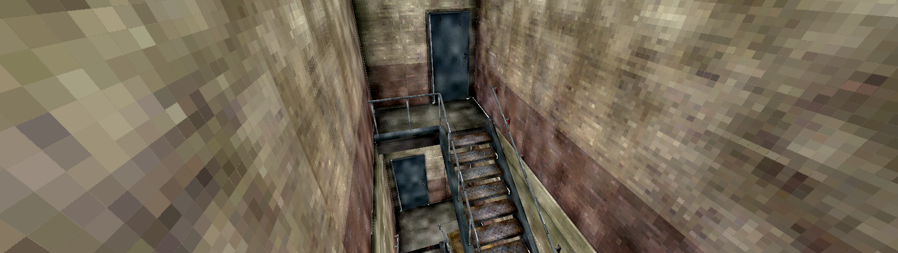
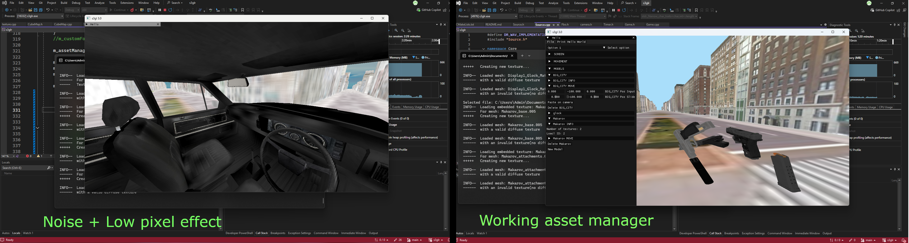

# S3DL-3.0

This is yet another remake of s3dl, I'm hoping to write clean and efficient code that doesn't get overcomplicated like s3dl 2.0. I am going to use a build system like cmake with this project and also use different naming conventions as something new to do.

___

### Features
Current working features include:
- Basic asset menu with imgui
- Model loading with assimp (with textures)
- Asset manager with:
	- Shader hot loading
	- Safe asset storage using std::shared_ptr
- A cubemap implementation for OpenGL

___

## How To Build	

__IMPORTANT: THIS PROJECT IS CURRENTLY IN A WORK IN PROGRESS STATE, A LOT OF THINGS ARE BROKEN__

Please note this is a __windows only project__. 
1. Clone the repository with `git clone https://github.com/ljlericson/S3DL-3.0 --recurse-submodules`
2. Navigate into the vcpkg dir and run `bootstrap-vcpkg.bat`
3. Open a command prompt in the vcpkg dir and run `vcpkg install` (IMPORTANT!! This will take around 20-30 minutes as it will download and build the dependencies for this project)
4. In the parent repo, run "generate.bat"ß
5. Go into the new build folder and double click the `s3glr.sln` file to open VS 2022.
6. Open the project's properties and navigate to `C++/Language` and set the standart to "Latest Preview..." (I am using the new C++26 features in this project)
7. Navigate to "Debugging" in the same properties window and set the current working directory to the parent director of the repo (I'm not sure how to do this other than paste the complete path)
8. Build and run...